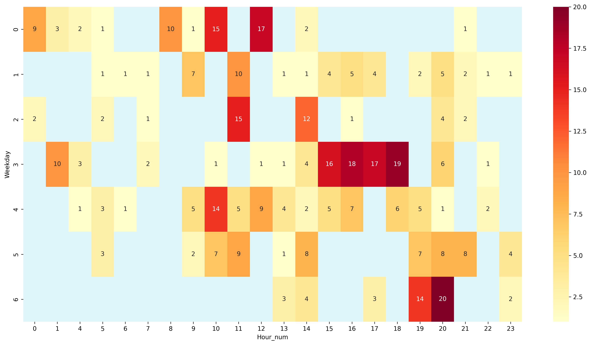

# Personal-Media-Consumption-Analytics
This project analyzes my personal digital behavior using:

- YouTube watch history  
- Apple Music listening data  
- Screen time logs  
- Study time records  

The goal is to explore patterns in daily routines, media consumption, and learning habits.

## Data Sources

All raw personal data is excluded from this repository for privacy reasons.

## Tech Stack

- Python
- pandas
- matplotlib
- Jupyter Notebook

## Structure

- notebooks/: analysis notebooks  
- src/: helper functions  
- figures/: generated plots  
- data/: processed sample data only


### **Methodology** 
Monthly cycle: Data → Analysis → Prediction → Validate

## 2026/2/18
**Step 1.1**: Apple Music CSV date conversion  
`20260115` → `2026-01-15` (`pd.to_datetime(format='%Y%m%d')`)  
Extracted Jan 2026 play history → `apple_playback_2026_jan.csv` export success!

**Step 1.2**: YouTube watch-history.json analysis  
```python
df["time"] = pd.to_datetime(df["time"], format="mixed", utc=True)
jan_2026 = df[(df["time"] >= "2026-01-01") & (df["time"] < "2026-02-01")]
```

## 2026/2/19
**Step 1.1**:Apple Music CSV to the raw data file
Moved the CSV file that made yesterday to the private file

**Step 1.2**:YouTube watch-history.json
Use SQL to filter the data and find the top 10 played video

## 2026/2/23
**Apple Music**
Find the top 10 Artist and top 10 songs played.
Created the head map of the playing time due to day average the week


### **Todo**

#### **Jan Analysis**
- [ ] Apple Music → SQLite database
- [ ] **Jan analysis**: 
  | Metric | SQL |
  |--------|-----|
  | Top videos | `SELECT title, COUNT(*) FROM youtube_jan2026 LIMIT 10` |
  | Time of day | `strftime('%H', time)` |
  | Play duration | `AVG(plays)` |
- [ ] Jan summary report
- [ ] Baseline prediction (Jan → Feb)
- [ ] Feb data collection start
- [ ] Screen time and study time to CSV

#### **Ongoing Monthly**
- [ ] Process new month
- [ ] Previous prediction accuracy
- [ ] Update year trend

#### **Year-End**
- [ ] Full 2026 dashboard


## Monthly Insights

### Jan 2026 Apple Music
#### TOP 10 Playes
[Artist]
1.SixTONES         138 plays
2.Mr.Children      107 plays
3.FRUITS ZIPPER     29 plays
4.ONE OK ROCK       28 plays
5.RADWIMPS          20 plays
6.Yuuri             18 plays
7.CUTIE STREET      17 plays
8.TENBLANK          17 plays
9.ARASHI            17 plays
10.CANDY TUNE        12 plays

[Songs]
1.JAPONICA STYLE                        16 plays
2.Sign                                  10 plays
3.Can we just be cute?                   8 plays
4.Anmarioboetenaiya                      8 plays
5.Forever Eve                            6 plays
6.Crystalline Echo                       5 plays
7.Glass Heart                            5 plays
8.Shirushi                               5 plays
9.Hatomame -Say Hello To The World.-     5 plays
10.Futarigoto                             4 plays

#### Play time Heatmap

- Friday AM peak
- Weekday PM focus
**Patterns**: Pre-weekend boost → Weekday relaxation routine